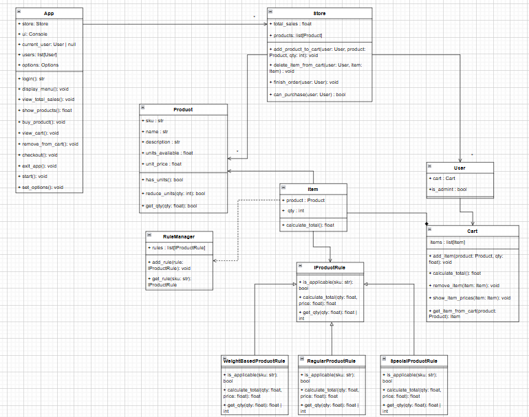

#Aspectos a resaltar

Creamos una nueva clase llamada app la cual nos permite interactuar con las diferentes entidades de la tienda.

Cambiamos la clase de ReglaPrecio por ReglaProducto(IProductRule), esto debido a que vimos la necesidad de abstraer mas partes de los productos como las unidades, como hay algunos produtos que no manejan unidades sino pesos, entonces al tener cantidad en los items, ahora podemos saber si la cantidad pedida debia ser entera (unidad) o flotante (peso).

